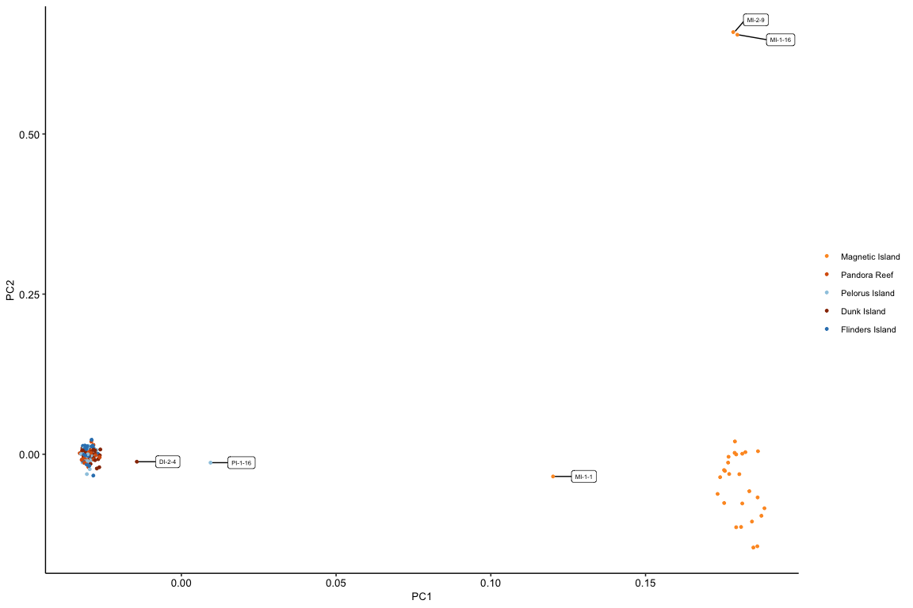

Population Structure
================

PCAngsd was used to examine population structure. This program is
specifically designed to work with low coverage data and calculates a
sample covariance matrix (used for PCA plotting) and admixture
proportions based on the optimal number of clusters.

As input data PCAngsd we used filtered SNPs in vcf format that were
called using Freebayes. The script
[01\_import\_vcf.sh](hpc/NGSAdmix/01_import_vcf.sh) uses ANGSD to
convert these Freebayes SNP calls into Beagle format while also
filtering for Hardy Weinberg equilibrium (p \< 1e-6). The command takes
the
form

``` bash
angsd -vcf-gl <input_vcf> -out <beagle_output> -fai <genome_index> -nind 148 -doMaf 1 -doGlf 2 -doMajorMinor 1 -SNP_pval 1e-6
```

PCAngsd was then run on these Beagle formatted files using the
command;

``` bash
python pcangsd.py -beagle <beagle_file> -threads 40 -admix -admix_save -admix_auto 10000 -o <output_file>
```

The covariance matrix can be used as the basis for a PCA. Plotting the
first two principle components reveals the clear Magnetic Island - North
distinction.

<!-- -->

Admixture proportions are also calculated by PCAngsd (based on optimal K
= 2). These can be plotted in the style of a STRUCTURE plot as
follows;

<!-- -->
