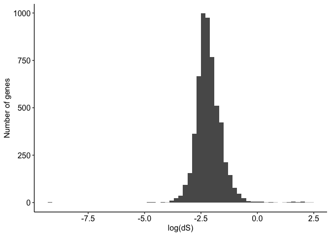

Mutation Rates
================
19/12/2017

Estimating the neutral mutation rate for a given species has
historically proven to be a challenging problem (see [this
review](https://paperpile.com/app/p/2777cb4a-5cd4-0fbc-88e3-7e20fc651d44)
). One approach is to use the fact that the accumulated divergence at
neutral sites between species is equivalent to the spontaneous mutation
rate (Kimura 1962). See [this
article](https://en.wikipedia.org/wiki/Fixation_\(population_genetics\))
for a brief explanation of this result.

A practical example of this approach can be found in the [original dadi
paper](https://paperpile.com/app/p/2ce90e5e-50d6-0861-a6c6-d0c9108a7184)
where the following formula is
used;


Where;

  -  is the
    mutation rate per base per generation
  - \(G\) is the generation time in years
  - \(t\) is the time in years

A factor of 2 is applied to account for the fact that nucleotide
divergence values are usually given in units of snps per base but since
two sequences are being compared a fixed mutation in either sequence
will result in a snp.

Here we derive the mutation rate using the divergence between *Acropora
digitifera* and *Acropora tenuis*, species that have diverged by
approximately 15 Million years (Mao, Economo, and Satoh 2018). In an
attempt to avoid non-neutral effects we use the synonymous substitution
rate between these species rather than the overall genome-wide
divergence.

Synonymous substitution rates were estimated as follows;

  - Single copy orthologs shared by three Acropora species (*A.
    millepora*, *A. tenuis* and *A. digitifera*) were identified using
    [ProteinOrtho](https://www.bioinf.uni-leipzig.de/Software/proteinortho/)
    version 5.15 based on amino acid sequences of gene models. (See the
    script [01\_protein\_ortho.sh](hpc/orthology/01_protein_ortho.sh))

<!-- end list -->

``` bash
proteinortho5.pl -project='acropora' adi.faa amil.faa aten.faa
```

  - Although three species were used to identify orthologs ( to ensure
    these were single copy genes common across Acroporid species ) only
    pairs of sequences from *A. tenuis* and *A. digitifera* were used
    for divergence estimates. These pairs were extracted and used to
    generate protein alignments using
    [MAFFT](https://mafft.cbrc.jp/alignment/software/) version 7.407.
    The script
    [02\_extract\_orthologs.sh](hpc/orthology/02_extract_orthologs.sh)
    captures this process.
  - Protein alignments were then converted to nucleotide alignments
    using [Pal2Nal](http://www.bork.embl.de/pal2nal/) version 14.
  - Finally these alignments were used as input for
    [codeml](http://abacus.gene.ucl.ac.uk/software/paml.html) which
    calculates values of dN and dS for each gene.

<!-- -->

The distribution of values dS follows a lognormal distribution as
expected for a quantity that is a ratio. A good value of dS to represent
the entire genome seems like the mean of this distribution, which is
0.115 (after exponentiating to remove the log).

We use this as an estimate of the per base substitution rate between
these species. Our goal is to convert this into a per base, per
generation mutation rate. To do this we use the divergence time between
them as 15.5 Million Years, assume a generation time of 5 years which
gives 1.86e-08. This value is slightly lower than the 2.8e-08 obtained
by (Mao, Economo, and Satoh 2018) using overall rates of divergence
(including non-synonymous SNPs).

Something to note here is that because of the relatively high divergence
time and large effective population size of these species it is quite
likely that we will have violated the infinite sites assumption. In
other words, a non-trivial number of sites will have undergone mutation
and fixation more than once. The divergence rate and therefore the
mutation rate is likely to be a lower limit to the true rate.

<div id="refs" class="references">

<div id="ref-Kimura1962-dy">

Kimura, M. 1962. “On the Probability of Fixation of Mutant Genes in a
Population.” *Genetics* 47 (June): 713–19.

</div>

<div id="ref-Mao2018-bu">

Mao, Yafei, Evan P Economo, and Noriyuki Satoh. 2018. “The Roles of
Introgression and Climate Change in the Rise to Dominance of Acropora
Corals.” *Curr. Biol.* 28 (21): 3373–3382.e5.

</div>

</div>
