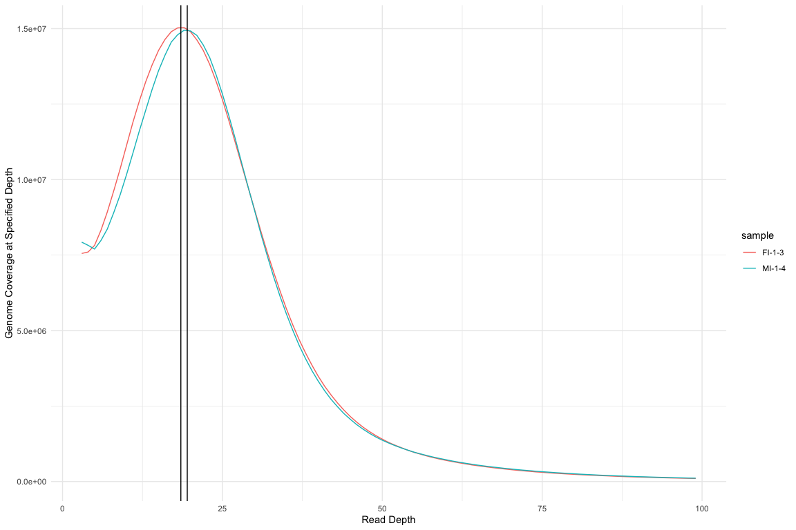
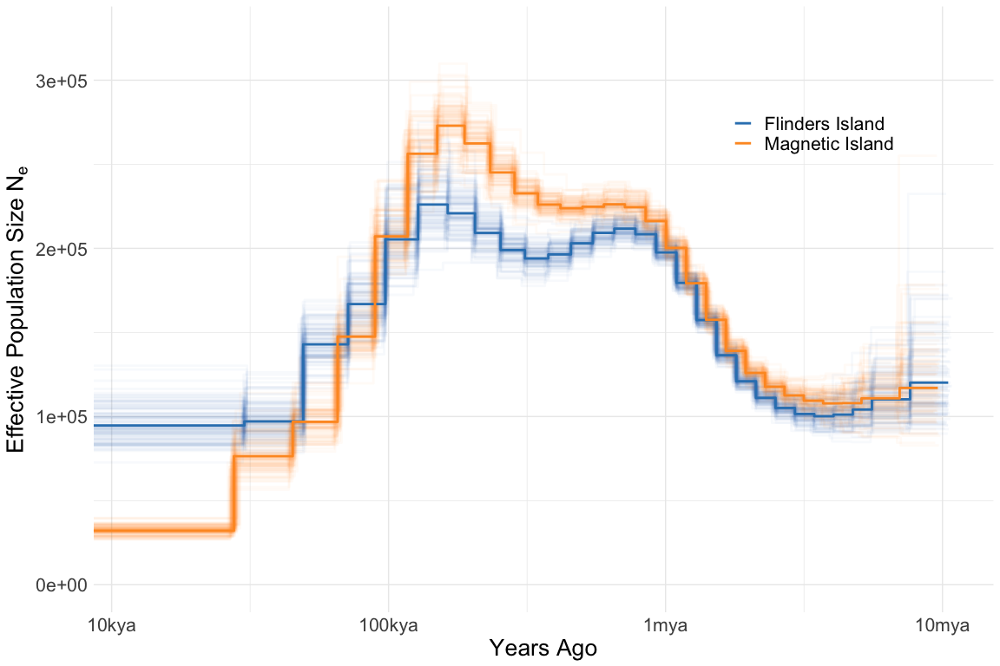

MSMC Analysis
================

We used [msmc2](https://github.com/stschiff/msmc2) to estimate changes
in effective population size over time from deep sequenced genomes. Two
such deep sequenced genomes were available, one from Magnetic Island
(MI-1-4) and one from Fitzroy Island (FI-1-3). Genome-wide read coverage
for these was assessed using the [bedtools
genomecov](https://bedtools.readthedocs.io/en/latest/content/tools/genomecov.html)
utility and is plotted below. Both genomes had a peak coverage depth of
slightly less than 20x with a long tail of higher coverage regions.

Data was therefore prepared for msmc analysis as follows;

  - The genome was masked using the
    [snpable](http://lh3lh3.users.sourceforge.net/snpable.shtml) suite
    of utilities. See [02\_snpable.sh](hpc/msmc/02_snpable.sh) for
    details.
  - Only contigs larger than 1Mb were included
  - A mappability mask was generated using `makeMappabilityMask.py` from
    [msmc-tools](https://github.com/stschiff/msmc-tools)
  - SNPs were called using the `bamCaller` python script assuming a mean
    genome coverage of 20x. See
    [04\_genomecov.sh](hpc/msmc/04_genomecov.sh) for details
  - Inputs for a single run were generated with the script
    `generate_multihetsep.py` from
    [msmc-tools](https://github.com/stschiff/msmc-tools)
  - Inputs for bootstraps were generated using the script
    `multihetsep_bootstrap.py` from
    [msmc-tools](https://github.com/stschiff/msmc-tools). 100 bootstraps
    were generated by taking 20 random chunks (per chromosome) of size
    500kb and assembling these into 20 “chromosomes”.
  - The [msmc2](https://github.com/stschiff/msmc2) program was run on
    each bootstrap using options appropriate for a single diploid sample
    (see script [07\_bootstrap.sh](hpc/msmc/07_bootstrap.sh))

<!-- -->

In order to turn msmc outputs into a demographic history we assumed a
mutation rate of 1.86e-08 (see
[02\_mutation\_rates.md](02_mutation_rates.md) ), and a generation time
of 5 years. The inferred population history is shown below.

<!-- -->

Write out the bootstrap averaged data in msmc format for ms analysis
(see [05\_sf2\_thresholds.md](05_sf2_thresholds.md))
