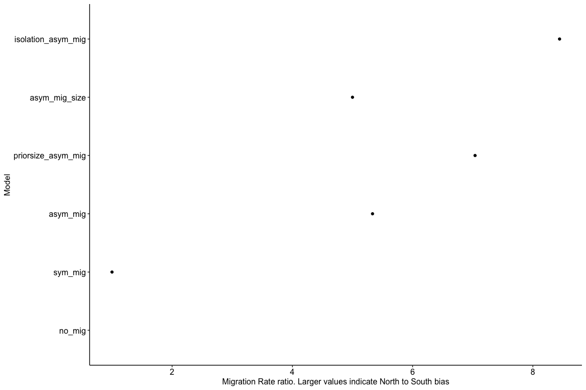

Demographic History with dadi
================

We modelled demographic histories for Magnetic Island and Northern
populations using dadi. This is a useful complement to msmc since it
uses fundamentally different data (joint SFS vs distribution of TMRCA).
In particular, since it uses information from many individuals it has
greater power to resolve more recent demographic changes. Our focus was
therefore on the manner of divergence between and subsequent gene flow
between the two populations. Although dadi allows arbitrarily complex
models we attempted to keep model complexity low to avoid problems with
fitting large numbers of parameters. The models used are shown below.

<!-- -->

Input to dadi is a set of variant sites and allele frequencies. These
are used to calculate a join site frequency spectrum for the two
populations (Magnetic Island and North) that feature in all models. The
starting point for generating these inputs were filtered Freebayes SNP
calls. These were then pruned to obtain a much smaller set of SNPs that
should be largely independent. A typical method to achieve this is to
use LD filtering but without accurate genotype calls our power to
calculate linkage was very low. To avoid potential artefacts that such
low power LD filtering could introduce we simply filtered based on
physical distance using [vcftools](https://vcftools.github.io/) version
v0.1.16 as
follows;

``` bash
vcftools --gzvcf <input>.vcf.gz --out <output> --thin 1000 --recode --recode-INFO-all
```

Since our data is low coverage sequencing we avoided any methods that
relied on genotyping to calculate allele frequencies. Instead we used a
custom python script [vcf2dadi.py](bin/vcf2dadi.py) which calculates
allele frequencies at each site by assuming that the read count for each
allele is proportional to its frequency. This script requires
pre-defined lists of samples belonging to each population so we first
built a list of samples in each Magnetic Island and Northern
populations, excluding outlying samples ‘MI-2-9’, ‘MI-1-16’ ,‘MI-1-1’,
‘PI-1-16’, ‘DI-2-4’ (see
[04\_make\_poplist.sh](hpc/dadi/04_make_poplist.sh)). We then ran the
`vcf2dadi` script as
follows;

``` bash
vcf2dadi.py -p clean.poplist.txt dadi_filtered_mac2_thin.recode.vcf --max-dev 0.5 --min-call 0.5 > dadi.thin1k.txt
```

The options `--max-dev 0.5` and `--min-call 0.5` ensure that sites low
call ratios, and those with highly divergent call ratios between MI and
Northern Populations are excluded. Since we did not have a closely
related genome (closest is \> 10Mya) we could not deduce the ancestral
state and therefore used folded SFS for all analyses.

To ensure that model fitting was able to adequately explore parameter
space we used modified versions of dadi optimisation scripts obtained
from [this github repository](https://github.com/dportik/dadi_pipeline)
and published as supp info to (Portik et al. 2017). Our code
modifications did not change the model fitting process but simply
allowed independent to runs to make use of multiple cpus. The model
optimisation strategy involves multiple rounds where each round a set of
replicate fits is performed based on a random perturbation of the
previous best-fit parameters. Once all fits are complete for a given
round the best parameters are chosen to progress to the next round. We
used four rounds with 10 replicates in each. All model fitting
procedures also included projection down to a smaller number of
haplotypes (45 for Magnetic Island, and 180 for Northern reefs) to deal
with missing data. The total number of sites remaining after this
projection was 15507.

Model fit was visually checked by plotting residuals using the script
[residuals.py](hpc/dadi/residuals.py). Residuals for the best fitting
model `isolation_asym_mig` is shown below. All other residuals plots can
be found in the folder `hpc/dadi/residuals`.

<!-- -->

After model fits are complete the best fit parameters can be extracted
as follows;

``` bash
cd hpc/dadi
bash 07_best_model.sh > best_models.tsv 
```

The included python script [dadi\_to\_ms.py](hpc/dadi/dadi_to_ms.py)
allows model parameters to be extracted in a form suitable for plotting
demographic histories as follows

``` bash
cd hpc/dadi
python dadi_to_ms.py --mode 'plot' > model_plots.tsv
python dadi_to_ms.py --mode 'params' > best_model_divmig.tsv
```

The plot below shows demographic history trajectories for all fitted
dadi models.

<!-- -->

To create these plots and also to assess divergence times and migration
rates is was necessary to convert from dadi to real units. To do this we
note that the value of theta used by dadi refers to the overall scaled
mutation rate across all sites. Thus there is an implied dependence on
some unknown effective locus size

when expressing the scaled mutation rate
 in terms of the per-site rate
.

  
  

The value of

can be estimated by using the fact that it consists of 15507 sites out
of a total of 14 million genome-wide. Therefore "). Times and effective population
sizes are then calculated using values of mutation rate and generation
time used in [02\_mutation\_rates.md](02_mutation_rates.md%5D) and
[03\_msmc.md](03_msmc.md).

The two dadi models with best fits (highest logLik values) gave similar
values for the Magnetic Island / North divergence time at around
250-300Kya.

<!-- -->

All models showed a biased migration rate from North to South. Given the
large discrepancy in effective population sizes between these
populations this could primarily be driven by population size. This is
because the migration rate is measured in terms of the proportion of
destination population contributed by migration. If the destination
population is small this can be large even if the number of migrants is
small.

<!-- -->

<div id="refs" class="references">

<div id="ref-Portik2017-fo">

Portik, Daniel M, Adam D Leaché, Danielle Rivera, Michael F Barej,
Marius Burger, Mareike Hirschfeld, Mark-Oliver Rödel, David C Blackburn,
and Matthew K Fujita. 2017. “Evaluating Mechanisms of Diversification in
a Guineo-Congolian Tropical Forest Frog Using Demographic Model
Selection.” *Mol. Ecol.* 26 (19): 5245–63.

</div>

</div>
