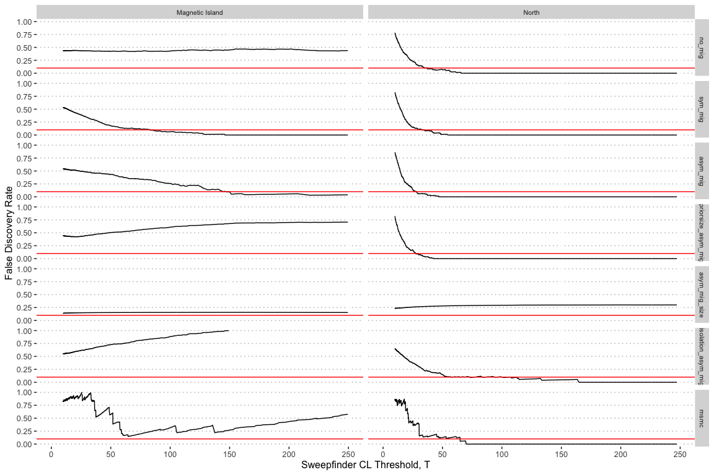

Search for selective sweeps with SweepFinder2
================

## SweepFinder2 analysis on real data

Input data for SweepFinder2 analyses was generated using the python
script [vcf2dadi.py](bin/vcf2dadi.py) with the sweepfinder output option
as
follows;

``` bash
vcf2dadi.py --sweepfinder -p clean.poplist.${pop}.txt ${contig}.vcf | awk '$2>0' > ${pop}/${contig}.af
```

where the file `clean.poplist.${pop}.txt` is an outlier free list of
samples for each of the five individual reefs as well as a combined
population (called `nomi`) representing all northern reefs.

SweepFinder was then run in grid mode for each contig in each population
with grid points spaced every 1000bp across the genome. (See scripts
[02\_empirical\_freq\_spectrum.sh](hpc/SF2/02_empirical_freq_spectrum.sh)
and [03\_find\_sweeps.sh](hpc/SF2/03_find_sweeps.sh)).

Full sweepfinder results were then converted to discrete regions by
amalgamating adjacent values greater than a threshold of 10 (See
[04\_sweeps\_to\_gff.sh](hpc/SF2/04_sweeps_to_gff.sh)). For each such
region we assign its CLR value to the maximum value in the region.

## Generation of neutral background CLR distribution

Sweepfinder2 calculates a composite likelihood ratio (CLR) statistic
across a grid of positions distributed evenly across the entire genome.
Since the CLR incorporates information from non-independent sites it
cannot be used to directly calculate probabilities of error. An even
more important issue is the fact that high CLR values can occur under
neutral evolution due to demographic changes such as recent population
bottlenecks or admixture between historically separate populations.

To account for these effects we ran simulations using the program `ms`
under various demographic scenarios and ran SweepFinder2 analyses on the
resulting outputs. These form a neutral model against which we were able
to compare SweepFinder2 results obtained from observed alleles in *A.
tenuis* populations from Magnetic Island and Northern populations.

The full suite of demographic models used included all [dadi
models](04_dadi.md) as well as population trajectories inferred by
[MSMC](03_msmc.md). In the case of dadi models we generated `ms`
commands using the included script
[dadi\_to\_ms.py](hpc/ddadi/dadi_to_ms.py) and checked that these were
consistent by running the script [check\_ms.py](hpc/dadi/check_ms.py).
This latter script generates data using ms and plots residuals based on
this data and the corresponding dadi model. We visually inspected these
residuals plots to ensure they were centered on zero, had no biases and
low variance. (See for example [this
plot](hpc/dadi/mscore_residuals/isolation_asym_mig.png))

For msmc models we use the population trajectories calculated for
Magnetic Island and Fitzroy Island individuals as input to the script
[msmc2ms.py](hpc/ms/msmc2ms.py) by Daniel Weissman. Outputs from this
were converted to Sweepfinder input using awk and full details are
provided in this [bash script](hpc/ms/02_simulate_msmc.sh).

Once ms commands had been generated for all models they were used to
generate a neutral background for the CLR statistic as follows;

  - `ms` was run on 500 x 1Mb chunks for each demographic model and
    outputs processed with `awk` to convert to SweepFinder2 format (see
    scripts [02\_simulate\_msmc.sh](hpc/ms/02_simulate_msmc.sh) and
    [03\_simulate\_dadi.sh](hpc/ms/03_simulate_dadi.sh)).
  - SweepFinder2 was run on each chunk using an identical uniform grid
    across all simulations (see [04\_combine.sh](hpc/ms/04_combine.sh)
    and [05\_find\_sweeps.sh](hpc/ms/05_find_sweeps.sh))
  - SweepFinder2 outputs were then processed to find distinct regions of
    the genome where the CLR statistic was above a background noise
    threshold (set to 10). This step is required in order to reduce
    multiple adjacent grid positions into a single independent value and
    was performed using the script [sf2gff.py](bin/sf2gff.py). For each
    such region we assign its CLR value to the maximum value within the
    region.

## False discovery rate calculation

Assuming that neutral demographic models simulated with `ms` represent
an accurate background distribution we calculated an empirical false
discovery rate as follows;

  - Combine sweep loci from real data with those obtained under neutral
    simulations into a single list
  - Sort the list by CLR value from lowest to highest
  - For a given threshold value,
     count the number of
    loci in the neutral dataset with
     and
    call this  (these
    represent false discoveries). Also count the number of real loci
    with  and call this . The false discovery rate for a given
     is then;   
      
  - The total number of sweep loci will differ slightly between
    simulated and real data but our goal is to compare these datasets
    purely on the shape of their distribution. We therefore apply a
    correction factor  and use . This will increase the FDR value if
    the real dataset has many more loci above the noise threshold than
    the neutral dataset and vice versa.

This leads to the following false discovery rates for various neutral
models for the Magnetic Island and Northern populations respectively.
Red vertical lines represent CLR threshold values for which the FDR
reaches 10%.

<!-- -->

For the analysis including all northern reefs together we used a CLR
threshold of 100 whereas when looking at reefs separately we used CLR
threshold of 50. What FDR do these correspond to

| model                | population |       fdr | threshold |
| :------------------- | :--------- | --------: | --------: |
| isolation\_asym\_mig | North      | 0.1018184 |       100 |
| isolation\_asym\_mig | North      | 0.1491746 |        50 |
