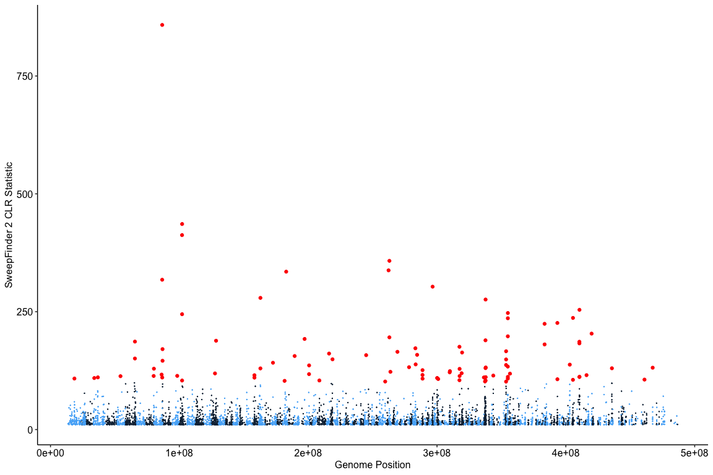

Interpretation of SweepFinder results
================

Due to the extreme demographic history of Magnetic Island we found that
it was not possible to distinguish selective sweeps from demographic
effects in that location. Consequently our interpretation of SweepFinder
results is restricted to Northern reefs. We examined loci with
significant sweep scores in two ways. Firstly we looked at the entire
Northern population as a whole for which sweeps could be interpreted as
being due to adaptations required across all inshore sites. Secondly we
looked at the difference between Marine (Fitzroy Island, Pelorus Island)
and Plume (Pandora Reef, Dunk Island) sites. Sweeps designated as
`Marine Only` or `Plume Only` were identified using bedtools (see
[11\_marine\_vs\_plume.sh](hpc/SF2/11_marine_vs_plume.sh) ). This
produced the following files;

  - `nomi_10_sweeps.gff` containing contiguous regions with SweepFinder
    scores \> 10 using pooled allele frequencies across all northern
    reefs.
  - `marine_only.gff` containing contiguous regions with SweepFinder
    scores \> 10 that were in marine sites and not in plume
  - `plume_only.gff` containing contiguous regions with SweepFinder
    scores \> 10 that were in plume sites and not in marine

Using the best fitting dadi model (`isolation_asym_mig`) as neutral
background a CLR threshold of 100 gives an FDR of approximately 10%. The
Manhattan plot below shows that these sites are distributed across the
genome.

<!-- -->

Genes associated with these significant loci were identified using
[bedtools
window](https://bedtools.readthedocs.io/en/latest/content/tools/window.html).
This reports all overlaps between sweep loci (encoded as
`nomi_10_sweeps.gff` and gene models). (see
[07\_genes\_in\_sweeps.sh](hpc/SF2/07_genes_in_sweeps.sh) for details).
A hand annotated version of this table is included as supplementary
information with the paper.

Gene Ontology annotations were obtained for these genes through GO terms
assigned to conserved domains (via Interproscan) and the results were
used to search for terms that might be enriched in the sweep set
compared to background. GO term enrichment analysis was done using the R
package topGO version 2.36.0 (Alexa, Rahnenführer, and Lengauer 2006)
using genes associated with sweeps (scores \> 100) as the target set and
all other annotated genes as background. topGO uses a weighting scheme
(we used the weight01 scheme) to downweight genes that are also attached
to related terms in the GO graph. Significance testing was performed
using Fisher’s exact test based on weighted gene counts. As outlined [in
the topGO
manual](https://bioconductor.org/packages/release/bioc/vignettes/topGO/inst/doc/topGO.pdf))
there is no clear way to apply a formal multiple-testing corrections for
this p-value.

A single GO term, `GO:0005509 calcium ion binding` was significantly
enriched among sweep genes. This term was associated with SOMPs as well
as EGF domain containing genes, both of which were abundant in the
target
set.

| GO.ID        | Term                | Annotated | Significant | Expected | classic | ontology |
| :----------- | :------------------ | --------: | ----------: | -------: | :------ | :------- |
| <GO:0005509> | calcium ion binding |       667 |           9 |     1.77 | 4.5e-05 | MF       |

Genes annotated with the GO term `GO:0005509 calcium ion
binding`.

| geneid             |   CLR | UniprotID    | Protein Name                                                                                                 |
| :----------------- | ----: | :----------- | :----------------------------------------------------------------------------------------------------------- |
| aten\_0.1.m1.7647  | 436.0 | FBN2\_HUMAN  | Fibrillin-2 \[Cleaved into: Fibrillin-2 C-terminal peptide\]                                                 |
| aten\_0.1.m1.7648  | 412.5 | FBN1\_MOUSE  | Fibrillin-1 \[Cleaved into: Asprosin\]                                                                       |
| aten\_0.1.m1.9801  | 188.4 | USOM5\_ACRMI | Uncharacterized skeletal organic matrix protein 5 (Uncharacterized SOMP-5)                                   |
| aten\_0.1.m1.4638  | 186.6 | SVEP1\_MOUSE | Sushi, von Willebrand factor type A, EGF and pentraxin domain-containing protein 1 (Polydom)                 |
| aten\_0.1.m1.18937 | 157.8 | HMCN2\_HUMAN | Hemicentin-2                                                                                                 |
| aten\_0.1.m1.14842 | 156.0 | EGF\_RAT     | Pro-epidermal growth factor (EGF) \[Cleaved into: Epidermal growth factor\]                                  |
| aten\_0.1.m1.31478 | 115.4 | LRP4\_HUMAN  | Low-density lipoprotein receptor-related protein 4 (LRP-4) (Multiple epidermal growth factor-like domains 7) |
| aten\_0.1.m1.29866 | 106.7 | FBN1\_HUMAN  | Fibrillin-1 \[Cleaved into: Asprosin\]                                                                       |
| aten\_0.1.m1.14286 | 103.3 | FRPC\_NEIMB  | Iron-regulated protein FrpC                                                                                  |

Alexa, Adrian, Jörg Rahnenführer, and Thomas Lengauer. 2006. “Improved
Scoring of Functional Groups from Gene Expression Data by Decorrelating
GO Graph Structure.” *Bioinformatics* 22 (13): 1600–1607.

