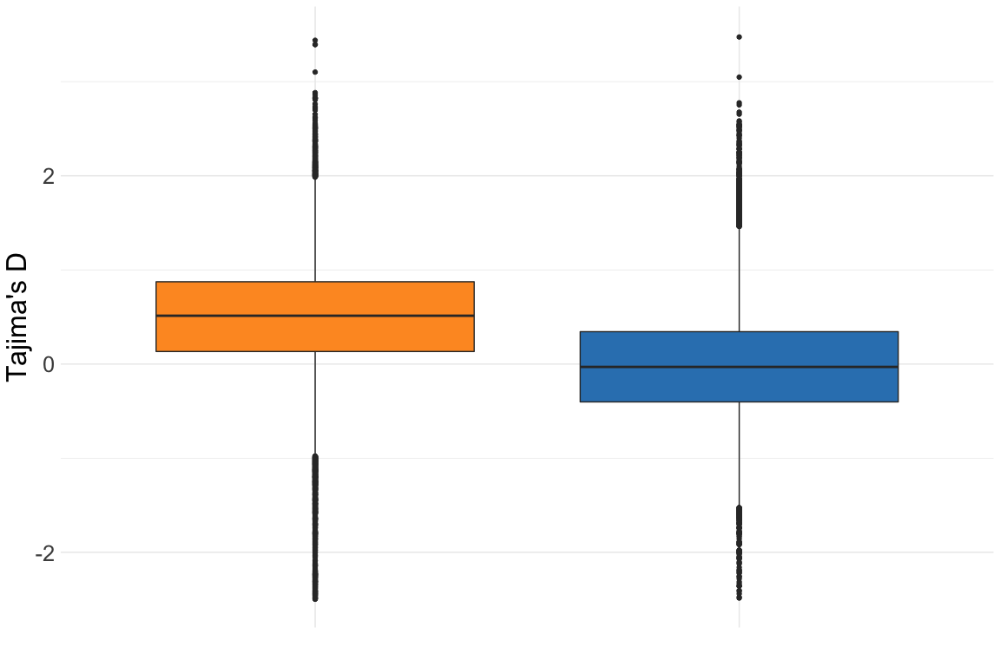

Population genetic statistics with ANGSD
================

[ANGSD](http://www.popgen.dk/angsd/index.php/ANGSD) (Korneliussen,
Albrechtsen, and Nielsen 2014) version 0.928 was used to calculate
diversity and neutrality statistics for all populations as follows (also
see [06\_folded.sh](hpc/angsd/06_folded.sh));

  - ANGSD and realSFS were used to calculate folded allele frequency
    spectra for each population based only on sites called as SNPs by
    Freebayes and passing the same standard quality filters imposed for
    all other analyses. This was done from aligned reads for a given
    population and used the *A. tenuis* reference for the genome and for
    the ancestral state as recommended
    [here](https://github.com/ANGSD/angsd/issues/65).

<!-- end list -->

``` bash
angsd -nThreads 32  -b ${POP}_bamlist.txt -anc $REF -out ${POP}_folded_af \
     -minMapQ 5 -minQ 20 -GL 1 -doSaf 1 -fold 1 -sites good_sites.txt

    realSFS ${POP}_folded_af.saf.idx -P 24 > ${POP}_folded_af.sfs
```

  - ANGSD and thetaStat were then used again to calculate diversity and
    neutrality statistics in overlapping windows (50kb wide with 10kb
    step) across the
genome.

<!-- end list -->

``` bash
    angsd -nThreads 32  -b ${POP}_bamlist.txt -out ${POP}_folded_af -doThetas 1 -doSaf 1 -pest ${POP}_folded_af.sfs \
        -minMapQ 5 -minQ 20 -anc $REF -GL 1 -fold 1 -sites good_sites.txt

    thetaStat do_stat ${POP}_folded_af.thetas.idx

    thetaStat do_stat ${POP}_folded_af.thetas.idx -win 50000 -step 10000  -outnames ${POP}_theta.thetasWindow.gz
```

  - For calculating Fst a similar process was followed but without using
    the -fold option since this requires an unfolded spectrum (see
    [here](https://github.com/ANGSD/angsd/issues/65)). First angsd was
    used to generate unfolded allele frequency
spectra

<!-- end list -->

``` bash
angsd -nThreads 32  -b ${POP}_bamlist.txt -anc $REF -ref $REF -out ${POP}_af \
     -minMapQ 5 -minQ 20 -GL 1 -doSaf 1 \
     -sites good_sites.txt
```

  - Then realSFS was used to calculate 2D spectra for each pair and
    subsequently calculate Fst (see
    [03\_allele\_freqs.sh](hpc/angsd/03_allele_freqs.sh),
    [04\_fst.sh](hpc/angsd/04_fst.sh) and
    [05\_fst\_windows.sh](hpc/angsd/05_fst_windows.sh))
  - Finally, both Fst and theta’s calculations genome-wide were
    converted to bed format so that regions overlapping sweeps could be
    found. For this purpose, overlap with all sweeps (including those
    likely to be demographic artefacts) was used. Details can be found
    in [10\_sweep\_overlaps.sh](hpc/angsd/10_sweep_overlaps.sh)

A boxplot of all Tajima’s D values genome-wide shows a clear bias toward
positive values for Magnetic Island

<!-- -->

A comparison of the distribution of Tajima’s D and Fst for the whole
genome versus sweeps with scores greater than 100.

<!-- -->

<div id="refs" class="references">

<div id="ref-Korneliussen2014-ah">

Korneliussen, Thorfinn Sand, Anders Albrechtsen, and Rasmus Nielsen.
2014. “ANGSD: Analysis of Next Generation Sequencing Data.” *BMC
Bioinformatics* 15 (November): 356.

</div>

</div>
