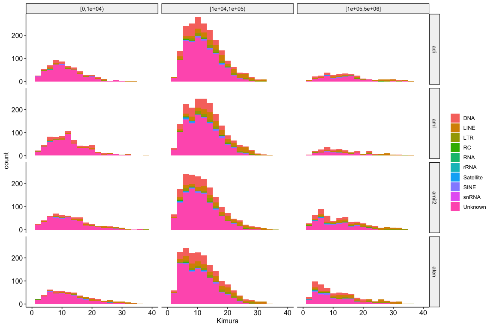
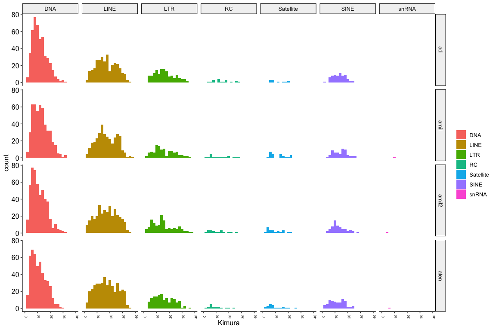

Repetitive Elements in Acroporid Genomes
================

Repeat content was analysed for the following Acroporid genomes;

  - *Acropora millepora* from short reads (`amil`) (Ying et al. 2019)
  - *Acropora millepora* from long reads (`amilv2`) obtained from
    <https://przeworskilab.com/data/>
  - *Acropora tenuis* this paper (`aten`)
  - *Acropora digitifera* version 1.1 from short reads (`adi`) obtained
    from genbank (Shinzato et al. 2011)

Each of these genomes was scanned for repeats as follows (using
`amil.fasta` as an example genome);

1.  [RepeatModeller](http://www.repeatmasker.org/RepeatModeler/) version
    1.0.8 was used to discover repeats

<!-- end list -->

``` bash
BuildDatabase amil.fasta -name amil
RepeatModeler-1.0.8 -database amil -engine ncbi -pa 10
```

2.  [RepeatMasker](http://www.repeatmasker.org/) version 4.0.7 was run
    using the database of repeats (`amil-families.fa`, output from step
    1) identified with RepeatModeller as follows;(`-a` option to writes
    alignments to a file)

<!-- end list -->

``` bash
mkdir -p amil_repeat_masker_out
RepeatMasker -pa 40 \
    -xsmall \
    -a -gff \
    -lib amil-families.fa \
    -dir amil_repeat_masker_out \
    -e ncbi \
    amil.fasta
```

3.  The script `calcDivergenceFromAlign.pl` included with RepeatMasker
    was used to calculate divergences from alignments created in step 2.

For each genome this process produces a file with extension
`.align.divsum` which includes weighted average Kimura divergences for
each repeat family. Assuming that individual copies within a family
diverge neutrally at a constant rate these divergences are a proxy for
the age of the family.

A broad overview of major repeat classes indicates that the overall
composition of repeats is largely unchanged across Acroporid genomes.
Unknown repeats comprise a large fraction of elements. One interesting
pattern is that genomes from long reads (`amil2`, `aten`) seem to have
higher counts of long repeats (longer than 100kb) which likely reflects
improved ability to assemble these. In the figure below columns divide
data by repeat length and rows represent the genomes (see above for
genome codes)

<!-- -->

Looking in detail at major classes of repeats we see that the `amil2`
assembly includes some very recent snRNA repeats that are not present in
`aten`. Since these are recent they could represent features that have
arisen since the split with *A. tenuis*

<!-- -->

<div id="refs" class="references">

<div id="ref-Shinzato2011-em">

Shinzato, Chuya, Eiichi Shoguchi, Takeshi Kawashima, Mayuko Hamada,
Kanako Hisata, Makiko Tanaka, Manabu Fujie, et al. 2011. “Using the
Acropora Digitifera Genome to Understand Coral Responses to
Environmental Change.” *Nature* 476 (7360): 320–23.

</div>

<div id="ref-Ying2019-qn">

Ying, Hua, David C Hayward, Ira Cooke, Weiwen Wang, Aurelie Moya, Kirby
R Siemering, Susanne Sprungala, Eldon E Ball, Sylvain Forêt, and David J
Miller. 2019. “The Whole-Genome Sequence of the Coral Acropora
Millepora.” *Genome Biol. Evol.* 11 (5): 1374–9.

</div>

</div>
