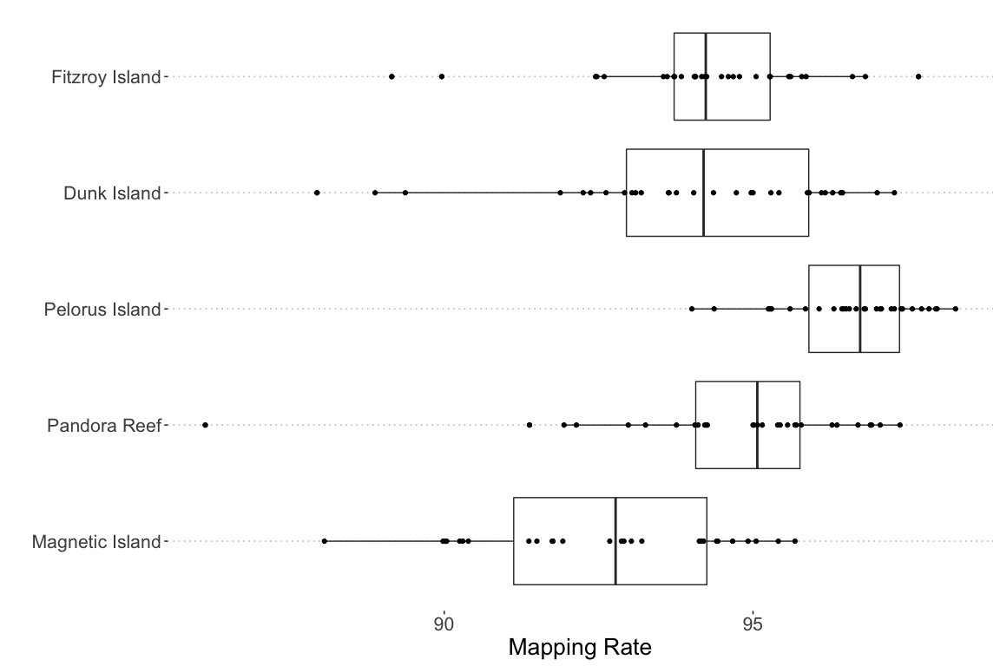

Read Mapping Rates
================

Overall read mapping rates were assessed using samtools flagstat which
reports the percentage of all reads having at least one mapping entry in
the bam file.

Note that since mapping is performed against the host genome these
numbers are significantly affected by the proportion of symbiont reads
in the sample. Almost all samples had high (\>90%) mapping rates but
mapping rates on average were slightly lower for Magnetic Island
samples. This could reflect the fact that the reference genome was built
from an individual from Pelorus Island (northern population). Of the
Northern reefs Pelorus Island had the highest average mapping rate.

<!-- -->
