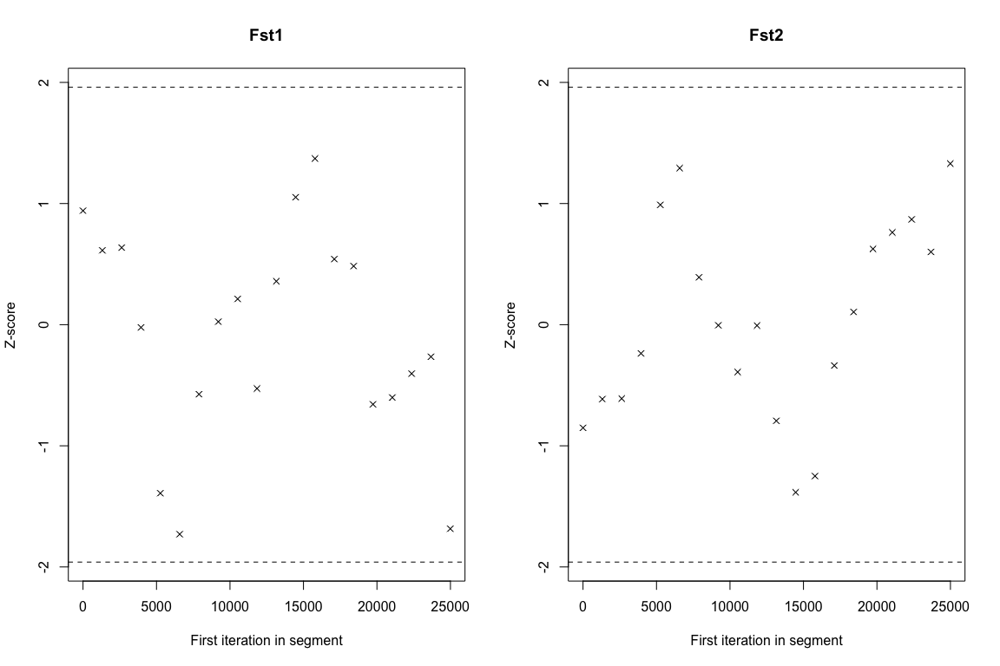
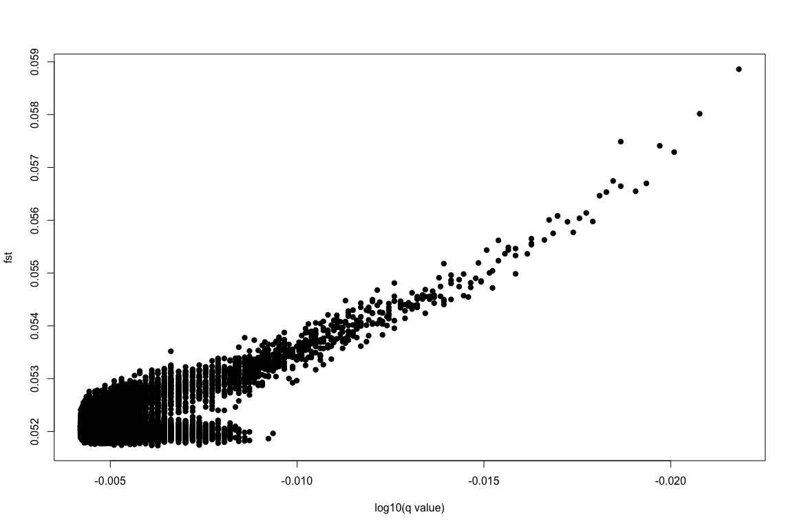

Analysis of differential selection with Bayescan
================

We used [Bayescan 2](http://cmpg.unibe.ch/software/BayeScan/) (Version
2.1) to search for genomic regions of high differentiation between
populations (Fst outliers) as indicators of positive selection. This was
performed separately for two sets of samples; firstly between all four
northern reefs, treating each reef as a separate sub-populations, and
secondly between northern reefs as a whole and Magnetic Island. This
separation between analyses was necessary because Bayescan 2 is not
designed to deal with hierarchical population structure, and as shown in
our population structure analyses the divergence between Magnetic Island
and northern populations was much greater than between individual
northern reefs.

In order to ensure that only independent loci were provided to Bayescan
2 we first thinned data to ensure a physical distance of at least 10kb.
This greatly improved computational run times while also maintaining the
integrity of false discovery rate calculations, which assume
independence of loci. Thinning based purely on linkage disequilibrium
was not possible since our low coverage data prevented accurate LD
calculations. This resulted in a total of 27109 sites available for
analysis across all sampling locations and populations.

The same allele frequency data used for SweepFinder 2 analyses was then
exported into Bayescan2 format using an `awk` script separately for
northern populations and for the Magnetic Island vs North comparison.

Since we have a large number of sites (\>27k) Bayescan 2 was run with
prior odds set to 1000. All other Bayescan parameters were kept at
defaults

# Northern Reefs

Convergence was assessed using the Geweke diagnostic. On this basis an
additional burn-in period was used for the Northern population analysis
(1 million instead of the 50k default) in order to achieve convergence.

    ## 
    ## Fraction in 1st window = 0.1
    ## Fraction in 2nd window = 0.5 
    ## 
    ##     Fst1     Fst2     Fst3     Fst4 
    ## -0.15332  0.03744 -0.07607  1.83573

<!-- -->

We used the `plot_bayescan` function provided with Bayescan to plot Fst
values and assess statistical significance of outliers. Even with false
discovery rate set to 0.2 no outliers were identified.

<!-- -->

## Magnetic Island vs North

    ## 
    ## Fraction in 1st window = 0.1
    ## Fraction in 2nd window = 0.5 
    ## 
    ##    Fst1    Fst2 
    ##  0.9406 -0.8517

<!-- -->

<!-- -->
