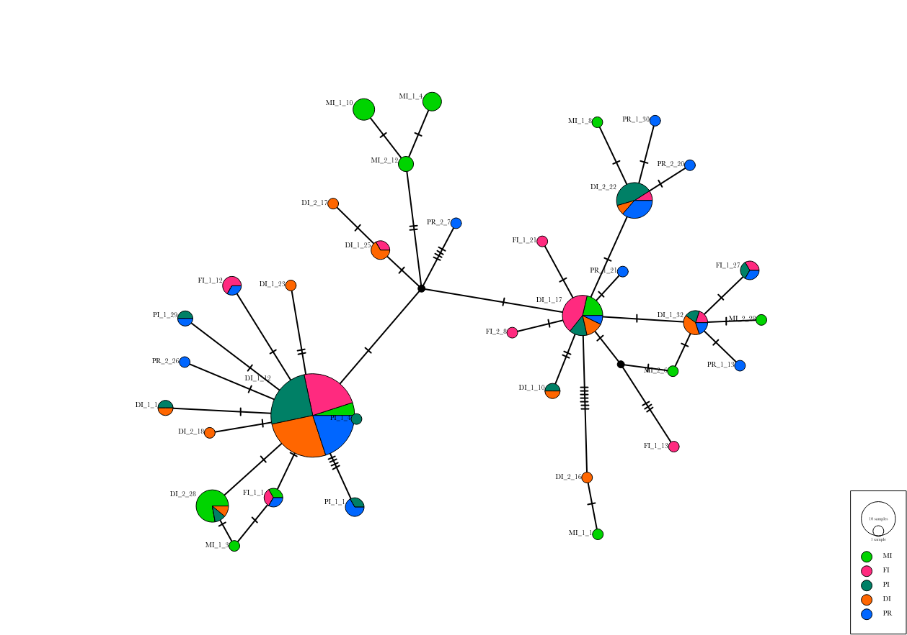

# Host mitochondrial genotyping

Since our denovo assembly of the A. tenuis mitochondrial genome was extremely similar to the existing [sequence on genbank](https://www.ncbi.nlm.nih.gov/nuccore/AF338425) we used the reference assembly for mapping and genotype calling of all samples.

We obtained mitochondrial sequenced for individual low coverage samples as follows;

- First all host reads (except duplicates) for each sample were mapped to the mito reference using bwa mem.  This produced a small bam file containing only mito reads for each sample. See the script [02_map_reads.sh](02_map_reads.sh) for the exact commands used.
- Mitochondrial reads were then used to call variants against the reference sequence using samtools mpileup, followed by bcftools to call a consensus sequence for the sample. (See script [03_call_consensus.sh](03_call_consensus.sh))
- Since consensus sequences were all the same length no alignment was necessary and they were simply concatenated to produce a set of haplotypes for network visualisation with [PopArt](http://popart.otago.ac.nz/index.shtml)

The resulting haplotype network is shown below

