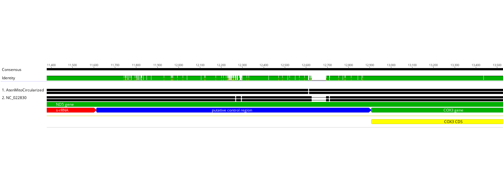

# Mitochondrial Genome Assembly

We assembled the *A. tenuis* mitochondrial genome using reads from a single deep sequenced sample from Fitzroy Island.  The assembly was performed with MITObim version 1.9 using the following command
```bash
MITObim.pl -end 10 -quick adi_mito_genome.fasta -sample 'FI' -readpool FI-1-3_pe.fastq -ref reference-mt --pair
```
The *A. digitifera* mitogenome was used as a bait. Each round MITObim assembles reads with the MIRA assembler and finds additional reads through matching to the bait and growing assembly.  

MITObim finished after 7 rounds resulting in a single contig of 19029bp. Manual inspection of this sequence revealed that it contained overlapping ends and could be circularised resulting in a final sequence of length 18338bp.  This is very close to the reference *A. tenuis* mitogenome on genbank (NC_022830) but includes some additional sequence in the putative control region.  



