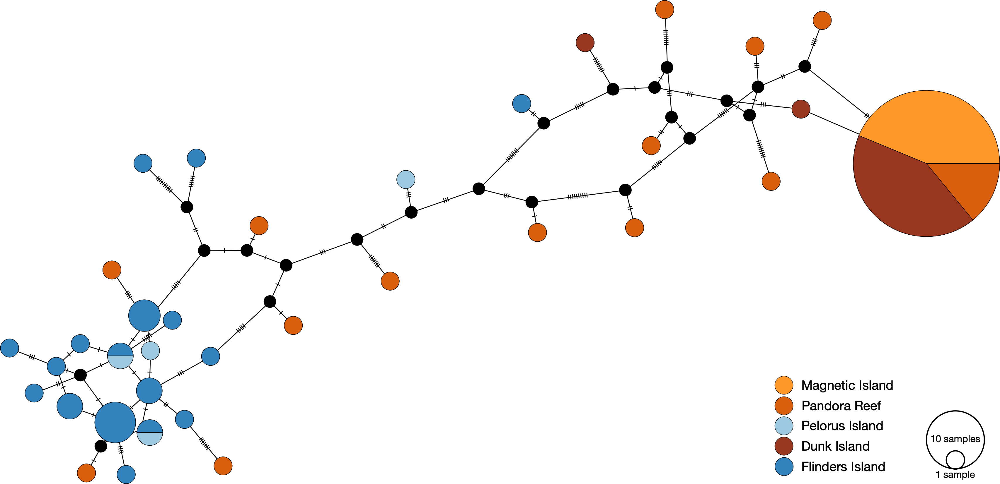

# Symbiont mitochondrial genotyping

As a reference sequence for symbiont mitochondrial genotyping we used the *Cladocopium* (C1) mitochondrial assembly obtained from [reefgenomics.org](http://symbs.reefgenomics.org/download/). 

To call consensus sequences against this reference we used the same process as was used for [host mitochondrial genotyping](../mito_mapping/README.md)

Coverage was much lower for symbiont mito-genomes than for host and was also much more variable across the reference sequence.  This reflects both the reduced overall number of available reads and large overall size of symbiont mito-genomes. We first removed samples with fewer than 2500 reads as these had such low coverage that consensus calling produced a high proportion of missing bases. 

The remaining 107 sample sequences were then imported to geneious and sites with ambiguities were stripped.  This resulted in a final alignment of 6170bp. 

The haplotype network resulting from this alignment is shown below;

